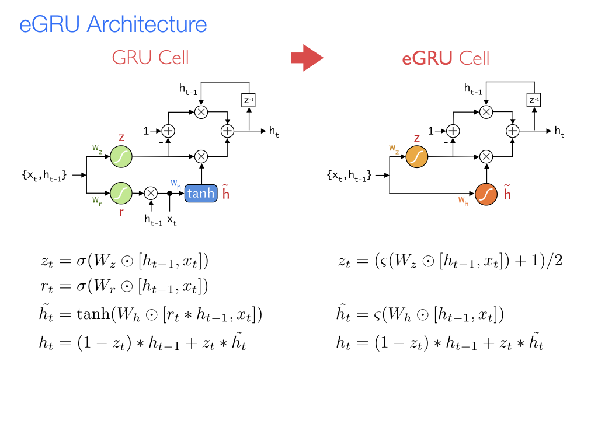

### Embedded Gated Recurrent Unit (eGRU) Implementation Details
This repository provides the sources for implementing the optimized eGRU recurrent cell as published in [An Optimized Recurrent Unit for Ultra-Low-Power Keyword Spotting](https://arxiv.org/abs/1902.05026). 

An eGRU cell features 4 major optimizations on top of the popular GRU architecture:
1. **Single Gate Mechanism**: Unlike the GRU cell, eGRU omits the reset gate to achieve a single gate recurrent unit. This saves reduces the computation and memory requirements by 33%.  
2. **Faster Activations**: Softsign activations are used instead of the sigmoid and tanh. Softsign is significantly faster in the absence of a floating point unit (FPU).
3. **Exponential Quantization**: All weights in eGRU are quantized to 3-bits, which are all integer exponents of 2. Thus, weight transformations in eGRU networks employ shift operations rather than multiplications.
4. **Integer Arithmetic**: eGRU networks are implemented entirely using Q15 integer arithmetic and are thus significantly faster on MCUs without FPUs.

